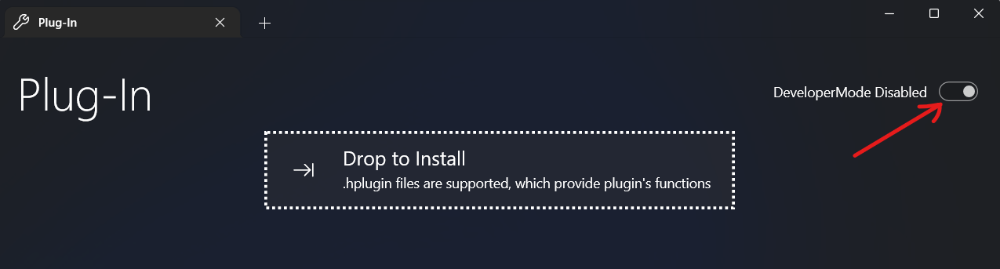

# Guide on How to Create a Hook Plugin
## Step1: Project Structure
- ../MyPlugin.hplugin
  - plugin.json
  - settings.json
  - main.js
  - logo.png
  - callable.js(register in plugin.json to take effect)

Let's take a deeper dive into each item
### .hplugin File
Actually ZIP archive, the plugin container
### plugin.json
Plugin manifest

Example be like:
```json
{
    "name": "MyPlugin",
    "description": "Sample plugin",
    "version": "0.8 alpha",
    "author": "Sample Author",
    "embed": ["callable.js"],
    "require": ["startWithSystem"],
    "settings": {
        "greeting": {
            "title": "Greeting",
            "description": "A simple greeting word",
            "type": "string",
            "icon": "character"
        },
        "pi": {
            "title": "дл",
            "description": "The Archimedes's constant, now changeable",
            "type": "double",
            "range": "(3.13, 3.15)",
            "icon": "placeholder"
        },
        "hooked": {
            "title": "Hooked",
            "description": "A simple switch",
            "type": "bool"
        }
    }
}
```
For more info about settings, head to [plugin.settings - The Hook API](The_Hook_API.md#settings-jssettings)
### settings.json
Default values of plugin settings

Example be like:
```json
{
    "greeting": "Hi",
    "pi": 3.14,
    "hooked": true
}
```
### main.js
Entry to the plugin where API is available. Shall be executed after Hook starts up

A common practice is to register to the event listener
```javascript
addEventListener("documentLoaded", (v) => {
    // v is short for DocumentView, a wrapped object from C#
    v.zoomFactor = 3
})
```
### logo.png
**Optional:** Avator to display in the plugin list

## Step2: The Hook API
API is a way to communicate with Hook, which can be accessed in the main.js script

**Note:** The Hook API hasn't been fully constructed yet. Changes expected.

Head to [The Hook API](The_Hook_API.md) for detailed documentation

## Step3: Debugging
Refering to the api, you should finish your first attempt and load the testing plugin
to the app. To do this, not hurry to pack. Instead, enable the DeveloperMode and
the plugin will be allowed to load directly from the folder



If you do not see expected behavior, you can change any code and save the file
Modifications will be applied to the plugin dynamically

## Step4: Packaging
After debug is completed, you can either turn off DeveloperMode, or uninstall the
debugged plugin. Then, simply compress the whole folder containing the plugin code
as a zip file, and install it in Hook. After a brief test, you should get the same behavior
as expected