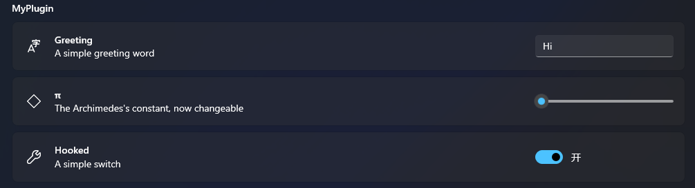

# The Hook API
API is a way to communicate with Hook, which can be accessed in the main.js script
## Guideline
The API should be a consistent, event-based and full-function coding experience.

**Note:** The Hook API hasn't been fully constructed yet. Changes expected.
## functions
### addEventListener(eventName, callback)
*parameters*
- **callback: function** triggered when the given event happens
- **eventName: string** can be one of the followings

|Name|Description|Callback Parameter|
|:---|:----------|:-----------------|
|documentLoaded|When a document is ready to be shown|[JSDocumentView](Hook/Plugin/Interpret/JSDocumentView.cs)|
|documentClosed|When a document is about to be closed|[JSDocumentView](Hook/Plugin/Interpret/JSDocumentView.cs)|
|settingsChanged|When a Plugin Settings item has been changed, either by user or by plugin itself|See [Guideline](#handling-dynamic-change-of-settings)|
|unload|When the plugin is about to be unloaded, usually app shutingdown or user uninstalling the plugin|nothing|
|systemStartup|When the plugin is loaded because of system starting up|nothing|

### getOpenedDocuments()
*return:* a read-only array containing each document shown in the tab view.

*see:* [DocumentView](Hook/Plugin/Interpret/JSDocumentView.cs)
### getRecentDocuments()
*return:* a read-only array containing each document touched recently, sorted from most recent to least

*see:* [IDcument](API/IDocument.cs)

### download(uri: string, [rename: string, [callback: function]])
#### param: uri
HTTP address to the desired file.

*see:* [HttpClient](https://docs.microsoft.com/en-us/windows/uwp/networking/httpclient)
#### param: rename
Desired file name, or the one provided by server if empty.
#### param: callback(path: string|integer|null)
Called when the operation is done.

If the file was successfully downloaded, *path* will be its absolute path to the local filesystem.
If it's an http error, it's state code will be given.
Otherwise, a null parameter is given in a system exception.

### httpAsString(uri: string, callback: function)
Download a HTTP site as string.
#### param: uri
HTTP address to the desired website.
*see:* [HttpClient](https://docs.microsoft.com/en-us/windows/uwp/networking/httpclient)
#### param: callback(content: string|integer|null)
Called when the operation is done.
If the file was successfully downloaded, *content* will be the desired string content.
If it's an http error, it's state code will be given.
Otherwise, a null parameter is given in a system exception.

### openDucment(path: string)
Open a document and bring it to user.

#### param: path
The file path to desired document.

### writeline(content: any)
Write some text into the Debug section.

### showInfoBar(title: string, message: string, severity: string = "")
Write some text into the InfoBar section.
#### param: severity
Different severity corresponds to different background colors and icons.

Can be one of the followings:
`error`,`warning`,`success`,`default`

*see:* [Guide by Microsoft](https://docs.microsoft.com/en-us/windows/apps/design/controls/infobar#severity)

## Properties
### window: [JSWindow](Hook/Plugin/Interpret/JSWindow.cs)
Represents the window of the app.
#### activate: function
Activate the application.
#### tryEnterFullscreen: function
Try to eneter fullscreen mode for the app.
### plugin: [JSPluginWrapper](Hook/Plugin/Interpret/JSPluginWrapper.cs)
#### createShortcut: function(name, description, [iconSymbol, ]path)
##### param name: string

Title of the shortcut, displayed as the document name.

##### param description: string
Subtitle of the shortcut, displayed like the document last touched date.

##### param iconSymbol: string
Icon to be displayed.

*See:* [Symbol by Microsoft](https://docs.microsoft.com/en-us/uwp/api/windows.ui.xaml.controls.symbol?view=winrt-22000)

##### param path: function(progressUpdater, resultInvoker)|string
This parameter can either be a string constant, a function that returns a string const or a function that
returns nothing and invokes its second argument with a string const. All you need to do is to provide the path
to the file to be opened by this method.

The **progressUpdater** parameter is a function that receives a double as the indicator of current progress, 
which ranges from 0 to 100 as percentage.

#### settings: [JSSettings](Hook/Plugin/JSSettings.cs)
##### get: function(key)
Get the value of a specific settings item.

*param key: string* The only identity of the settings item.

*return* Value of the desired item.
##### put: function(key, value)
Modify the value of a specific settings item.

*param key: string* Identity of the item to be modified.

*param value: string* Value to modify.

**Note:** value you put should be consistent with what is written
in the plugin manifest.

For more info, head to the [Guidline](#guideline-to-plugin-settings).

### Guideline to Plugin Settings
Your settings logic should be user-interactive, which is implenented by
adding external controls in the Settings page. To make that work,
screen info and data type should be defined.
So here is the pattern of settings manifest in plugin.json you should follow.
```json
{
	//basic plugin info...
	"settings": {
		"<Item Key 1>": {
			"title": "<Title of the item, displayed like a preference name>",
			"description": "<Description of the item, working as a detailed explanation of this item>",
			"icon": "<Symbol by Microsoft>",
			"type": "int|long|double|string|bool",
			["range": "\[|(<number>,<number>\]|)"] // available only if it's a numeric type
		},
		//maybe more settings items...
	}
}
```
The example plugin shown in the [tutorial](How_To_Create_Plugin.md#pluginjson) should look like this:

#### Handling dynamic change of settings
Because of the uncertainty of the source of changes to settings (the user or the program), it's better
to **react** to changes, rather than merely save them to a file.

To achieve this, the event system is just the suitable person.
```javascript
addEventListener("settingsChanged", s => { // s is a wrapped object from C#
	if (s.key === 'greeting') {
		ShowInfoBar("MyPlugin", "Greeting is now " + s.value)
	}
})
```

Additionally, if the settings item can only be applied after the app reloads,
an InfoBar should be shown to notify the user about it. For example, changes
that are made to Plugin Shortcut.